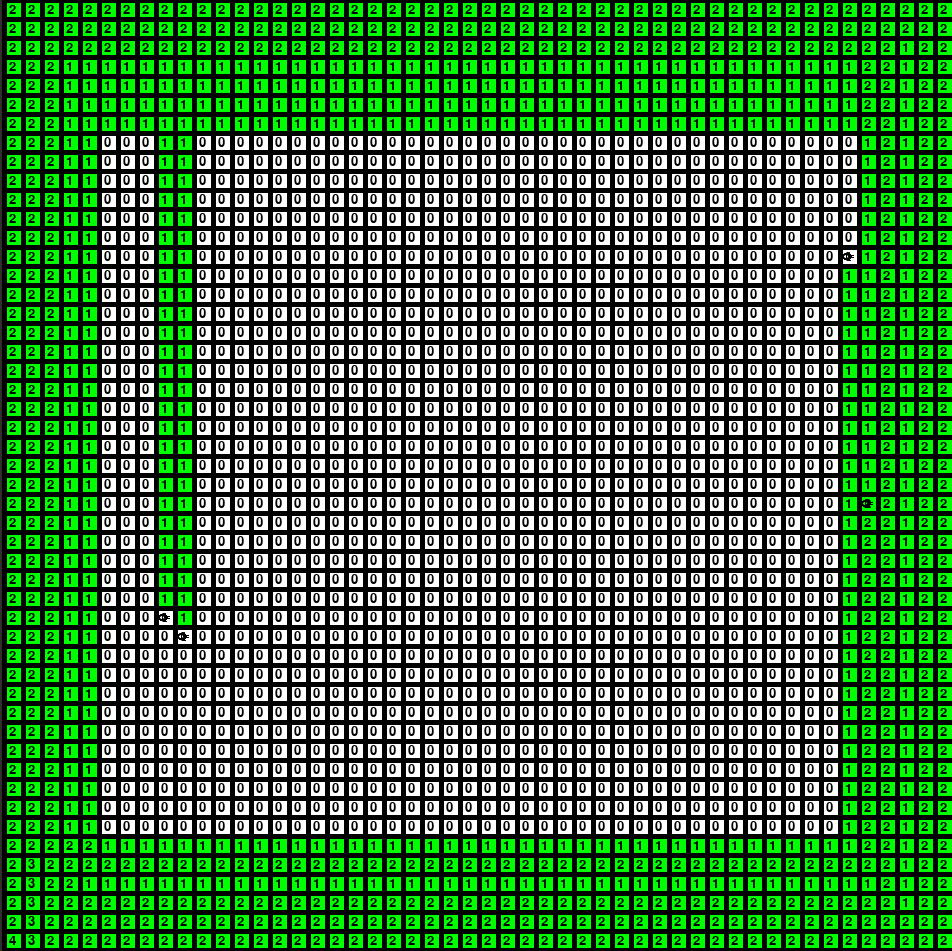
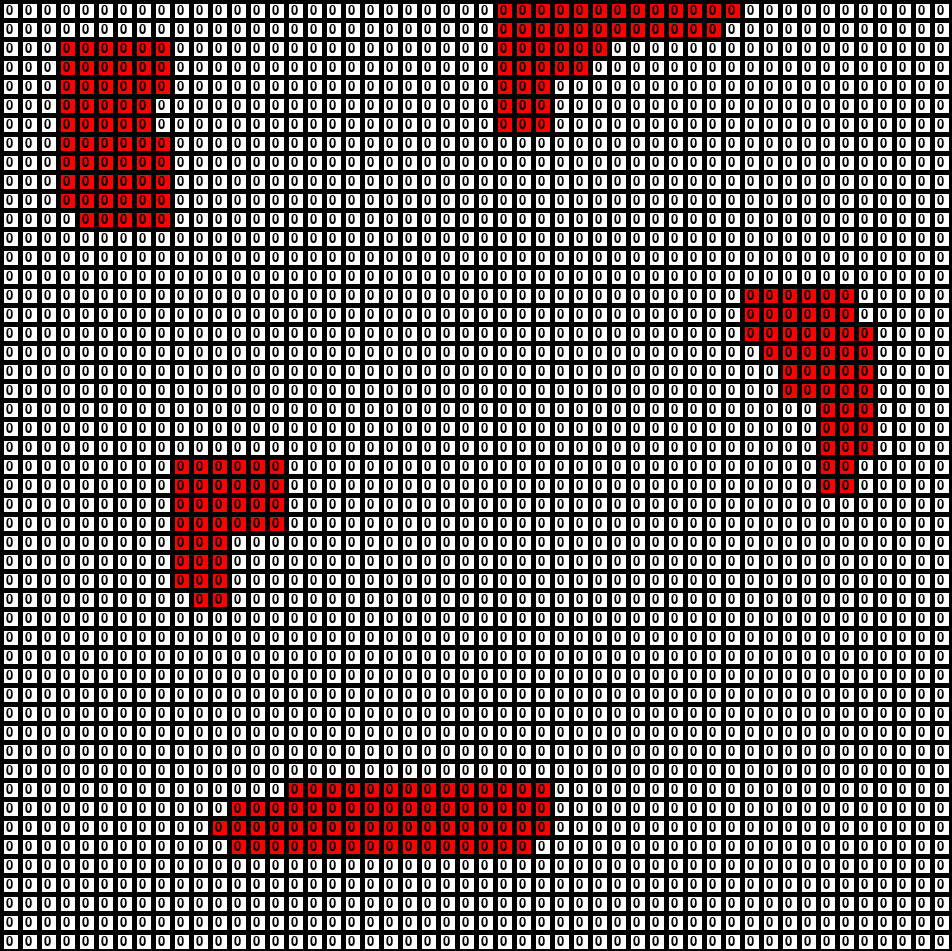
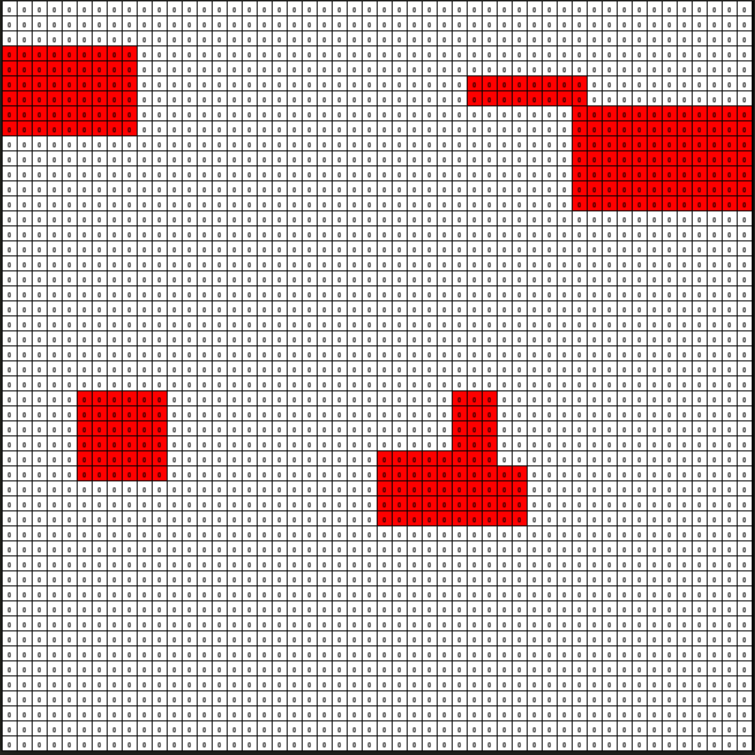
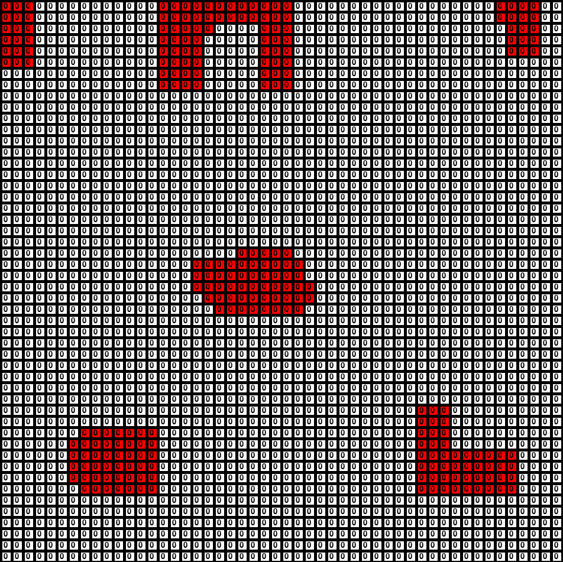

# patrolling-algorithms

The test platform was built using the PyGame library. The scenario is a 50×50grid containing four UAVs modeled as robot-agents. We present four types of scenarios, one free of obstacles and other three containing different compositions of no-fly zones  (NFZ). The aerial robots cannavigate through the scenario, interact with each other, and avoid the NFZ. The starting position of the UAVs is at thelower-left corner of the scenario.   

## Scenario

## No Fly Zone Scenarios
  
